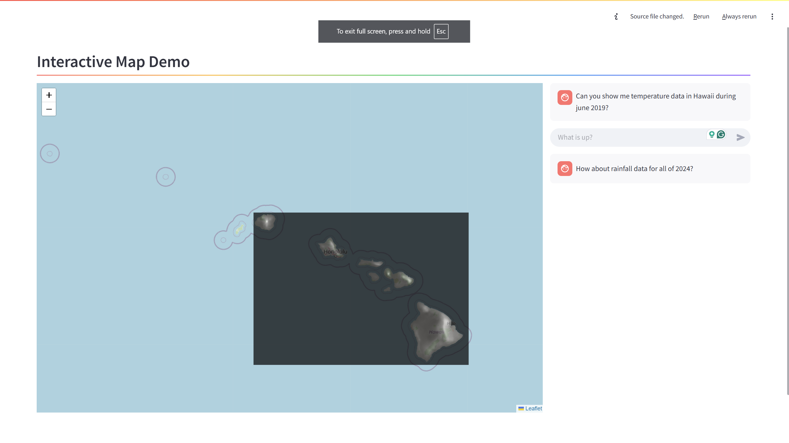

# Natural Language-Based Data Exploration for the Hawaii Climate Data Portal

This repository contains the code for a web app that allows users to interact with [Hawaii Climate Data Portal](https://www.hawaii.edu/climate-data-portal/) data using a map and natural language prompts. This project was developed on Saturday, March 5th, 2025, as part of the [**Aloha Data: AI Hackathon for Hawaiʻi’s Resilience**](https://datascience.hawaii.edu/ai-hackathon/). The web application is capable of displaying monthly and yearly rainfall and temperature data layers on an interactive map based on user prompts. Below is an example of a layer displayed according to user prompts

This framework uses `gemini-2.0-flash` via Google Cloud to convert use prompts into relevant information for Hawii Climate Data Portal APIs.

